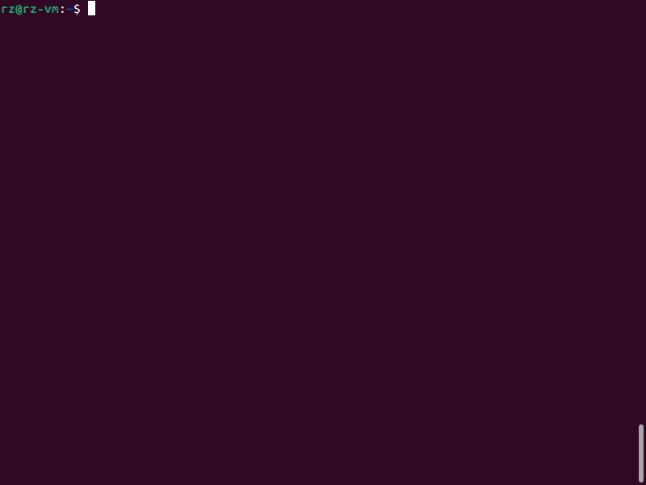

# chat-cli

`chat-cli` is a command-line interface (CLI) tool written in Go that allows you to interact with the OpenAI GPT models to generate text from a prompt.



## Installation

Make sure you have Go installed on your machine. If not, download and install it from [here](https://golang.org/dl/).

You can install `chat-cli` by cloning the repository and building it:

```bash
git clone https://github.com/ruzmuh/chat-cli.git
cd chat-cli
go install .
```

## Usage

To use `chat-cli`, you need to provide a prompt as an argument:

```bash
chat-cli "prompt"
```

You must have an OpenAI API token to use `chat-cli`. You can obtain it from [OpenAI's platform](https://platform.openai.com/). Once you obtain the token, you must add it to the `chat-cli` configuration using the `--init` flag before your first run.

You can also use various flags:

- `--codeonly`: If this flag is set, only the first code snippet from the response will be printed.
- `--init`: Initialize a config file for `chat-cli`. This is especially important for the first-time setup as you need to provide your OpenAI API token.
- `--list-models`: List all available models and exit.
- `--model`: Select a specific model to use.
- `--token`: Provide your OpenAI API token.
- `--version`: Print the version of `chat-cli` and exit.

### Environment Variables

The `--codeonly`, `--model`, and `--token` flags can also be set as environment variables. Prefix them with `CHATCLI_`:

- `CHATCLI_CODEONLY`
- `CHATCLI_MODEL`
- `CHATCLI_TOKEN`

### Priority Order

The priority order for settings is as follows:

1. Command-line arguments
2. Environment variables
3. Configuration file values

This means that if you set a value both as a command-line argument and in the configuration file, the command-line argument will take precedence.

### Examples

```bash
# Use a specific model
chat-cli --model "text-davinci-003" "What is the weather like?"

# Set a model as an environment variable
export CHATCLI_MODEL="text-davinci-003"

# List available models
chat-cli --list-models

# Initialize config
chat-cli --init

# Use a specific token
chat-cli --token "yourtoken" "What is the weather like?"

# Set a token as an environment variable
export CHATCLI_TOKEN="yourtoken"

# Print version
chat-cli --version
```

## Configuring `chat-cli`

`chat-cli` looks for a configuration file named `config.yaml` in the following directories, in order:

1. `$HOME/.config/chat-cli/`
2. `/etc/chat-cli/`
3. Current directory (`.`)

You can create or replace the config file in `$HOME/.config/chat-cli/` by running `chat-cli` with the `--init` command:

```bash
chat-cli --init
```

The configuration file allows you to set the default model and your OpenAI API token.